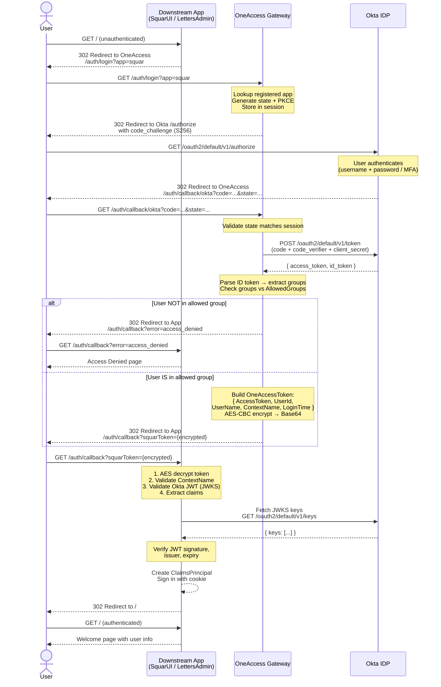
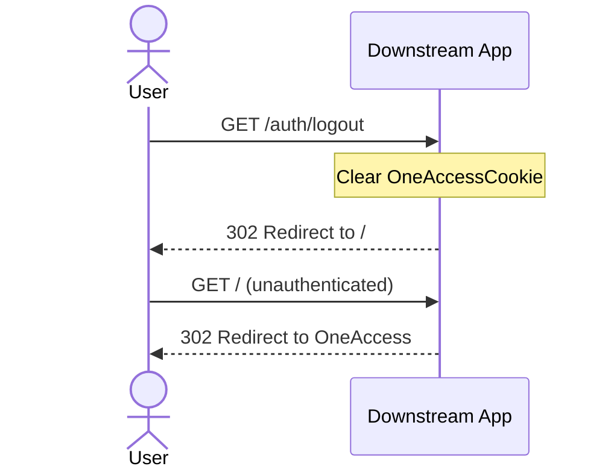
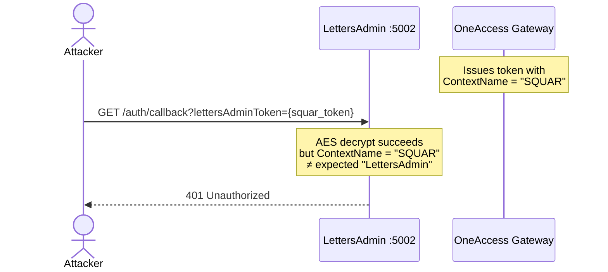

# OneAccess Gateway Architecture

OneAccess is a centralized SSO gateway that authenticates users against Okta and distributes AES-encrypted tokens to registered downstream applications. Downstream apps never interact with Okta directly for login — they receive, decrypt, and validate the wrapped JWT.

## System Overview

```
┌────────────┐       ┌────────────────┐       ┌──────────────────────────┐
│  SquarUI   │       │   OneAccess    │       │         Okta IDP         │
│  :5001     │◄─────►│   Gateway      │◄─────►│ integrator-5446987       │
│            │       │   :5050        │       │ .okta.com                │
├────────────┤       │                │       │                          │
│ Letters    │       │                │       │  - OIDC + PKCE           │
│ Admin      │◄─────►│                │       │  - Groups claim          │
│  :5002     │       └────────────────┘       │  - JWKS endpoint         │
└────────────┘                                 └──────────────────────────┘
```

## Sequence Diagram

### Full Login Flow



### Logout Flow



### Token Replay Prevention



## Encrypted Token Envelope

OneAccess wraps the Okta JWT in an AES-encrypted envelope before passing it to downstream apps. This is **not** a session cookie, auth code, or SAML assertion.

### Structure

```json
{
  "AccessToken": "<raw Okta JWT string>",
  "UserId": 123,
  "UserName": "john.doe@example.com",
  "ContextName": "SQUAR",
  "LoginTime": "2026-05-06T19:00:00Z"
}
```

### Encryption Details

| Parameter | Value |
|-----------|-------|
| Algorithm | AES-256-CBC |
| Padding | PKCS7 |
| Key derivation | SHA256 hash of config string → 32 bytes |
| IV derivation | MD5 hash of config string → 16 bytes |
| Output encoding | Base64 |

The encrypted token is passed as a **query parameter** — not a header or cookie:

```
GET /auth/callback?squarToken=kF7j2x...Base64...==
```

## App Registration

Each downstream app is registered in OneAccess with:

```json
{
  "AppName": "SQUAR",
  "AppIdentifier": "squar",
  "AppURL": "http://localhost:5001/auth/callback",
  "TokenParameterName": "squarToken",
  "AllowedGroups": ["squar-group"]
}
```

| Field | Purpose |
|-------|---------|
| `AppName` | Becomes `ContextName` in the encrypted token. Used for replay prevention. |
| `AppIdentifier` | URL-safe key used in `?app=squar` login redirect. |
| `AppURL` | Where OneAccess redirects after successful auth. Validated against allowlist. |
| `TokenParameterName` | Query parameter name for the encrypted token. |
| `AllowedGroups` | Okta groups required to access this app. |

## Downstream App Validation

When a downstream app receives the encrypted token, it performs 4 validation steps:

```
Encrypted token (Base64 string)
        │
        ▼
┌─── AES Decrypt ───┐
│  Key/IV from env   │──── Failure → 401
└────────┬───────────┘
         │
         ▼
┌─── ContextName ───┐
│  Must match app    │──── Mismatch → 401 (replay prevention)
└────────┬───────────┘
         │
         ▼
┌─── JWT Validate ──┐
│  JWKS signature    │
│  Issuer check      │──── Invalid → 401
│  Expiry check      │
└────────┬───────────┘
         │
         ▼
┌─── Extract Claims ─┐
│  email, name,       │
│  groups, sub        │──── Build ClaimsPrincipal → Cookie sign-in
└─────────────────────┘
```

## Project Structure

```
solution/
├── Shared/                     # Class library (referenced by all)
│   ├── Models/OneAccessToken.cs
│   └── Encryption/AesTokenEncryptor.cs
│
├── OneAccess/                  # SSO Gateway (:5050)
│   ├── Controllers/AuthController.cs    # /auth/login, /auth/callback/okta
│   ├── Services/
│   │   ├── OktaAuthService.cs           # PKCE, authorize URL, token exchange
│   │   └── AppRegistryService.cs        # App lookup, group auth, URI validation
│   └── Models/RegisteredApp.cs
│
├── SquarUI/                    # Downstream app (:5001)
│   ├── Controllers/
│   │   ├── AuthController.cs            # /auth/callback, /auth/logout
│   │   └── HomeController.cs            # /, /Home/AccessDenied
│   ├── Services/OneAccessTokenValidator.cs  # Decrypt + JWKS validate
│   └── Middleware/OneAccessAuthMiddleware.cs # Redirect if unauthenticated
│
├── LettersAdmin/               # Downstream app (:5002)
│   └── (same structure as SquarUI, different config)
│
├── docker-compose.yml
└── .env                        # Okta creds + AES key/IV
```

## Security Considerations

| Concern | Mitigation |
|---------|-----------|
| Open redirect | Redirect URIs validated against registered `AppURL` allowlist |
| Token replay across apps | `ContextName` checked by each downstream app |
| Token tampering | AES encryption — altered ciphertext fails decryption |
| CSRF on Okta flow | `state` parameter validated in callback |
| Code interception | PKCE (S256) prevents authorization code theft |
| Expired tokens | Okta JWT `exp` claim validated against JWKS |
| Secret leakage | All credentials via environment variables, never in code |

## Running Locally

```bash
# 1. Fill in .env with real Okta credentials
# 2. Set Okta redirect URI to http://localhost:5050/auth/callback/okta

docker-compose up --build

# OneAccess Gateway:  http://localhost:5050
# SquarUI:            http://localhost:5001
# LettersAdmin:       http://localhost:5002
```
